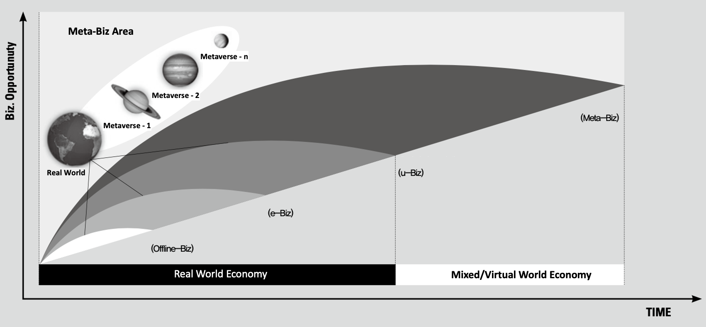

# Metaverse as a Next Generation Ubiquitous & Internet Biz

**TABLE OF CONTENTS**

- [Background](#😭-background)
- [Different Approach from U-Biz to Meta-Biz](#💰-different-approach-from-u-biz-to-meta-biz)
- [Article](#📝-article)
- [Brainstorming](#🧠-brainstorming)
- [Conclusion](#😊-conclusion)

## 😭 Background
- We are in the economic recession now based on many factors such as inflation and war in the world.
- More than **88,000 workers** in the U.S. tech sector have been **laid off** in mass job cuts in 2022, according to a [Crunchbase News tally](https://news.crunchbase.com/startups/tech-layoffs-2022/).
- Therefore, I would like to think of **how to enhance the economic situations** based on more **job opportunities creation**.
- As one of ways to expand the business area, I would like to suggest the different approach of **Metaverse economy** as the **next generation ubiquitous business**.

## 💰 Different Approach from U-Biz to Meta-Biz

- Someone think that Metaverse may fail as virtual reality is separated area with the current internet business.
- However, we could differently think such that we already live in Metaverse. Because the real world is part of Metaverse which calls Mixed Reality.
- Hence, I would like to suggest a new idea of formula where `Meta-Biz = V-Biz + U-Biz + E-Biz + Offline-Biz` as the following picture and table.




Biz Area        | Description         | Different Thinking                 
----------------|---------------------|------------------------------------
**Offline-Biz** | Retail store        |                               
**E-Biz**       | Internet Business   | `E-Biz    = Internet-Biz + Offline-Biz`
**U-Biz**       | Ubiquitous Business | `U-Biz    = U-Biz + E-Biz + Offline-Biz`
**Meta-Biz**    | Meta Business       | `Meta-Biz = V-Biz + U-Biz + E-Biz + Offline-Biz`

## 📝 Article

The following articles are to share the idea of Meta-Biz as tne next generation ubiquitous business. It was written by Korean in 2008 and has been translated by Google Translator in 2022. (So, there might be mistranslation or typo.)

- [Meta-Biz as a next generation U-Biz (KR)](./docs/Meta_Biz_KR_2008.pdf)
- [Meta-Biz as a next generation U-Biz (EN - Auto-translated by Google Translator)](./docs/Meta_Biz_AutoTranslation_EN_2008.pdf)

> Notes:
>
> - Special thanks to [James D.K. Kim](https://www.linkedin.com/in/james-d-k-kim-9990975b/) (SVP of VIRNECT, Former Head of Mixed Reality Lab at Samsung) whom I worked with for Metaverse project in 2007.
> - He proposed new paradigms of metaverse economy like Z industry and space innovation.
> - Afterwards, I could ideate and publish the Meta-Biz which combined the ubiquitous and internet business in 2008.


## 🧠 Brainstorming

- As of now in 2022, Facebook changed the name of company as Meta, and lots of companies have been working on Metaverse business.
- Some companies do not use the keyworkd of Metaverse, but they are working on some part of Metaverse area like AR and VR.
- I would say some companies business do not involve the virtual world are also working on Metaverse. It means that everything is already in Metaverse such as ubiquitous.
- Brainstorming is a simple, natural strategy for ideation and problem solving. It motivates people to dream up new ideas that may seem a little insane without negative feedback each other at first.
- I would like to start brainstorming together to find how to expand the business area based on next internet/ubiquitous business (a.k.a. Meta-Biz or other key word if you want).


## 😊 Conclusion
- This article is a type of campain to influence people with positive approach using the following Meta-Biz as the next generation U-Biz to resolve the economic recession.
  ```
  Meta-Biz (to expand business area) = V-Biz + U-Biz + E-Biz + Offline-Biz
  ```
- We can make other key word if anyone has better naming instead of `Meta-Biz`.
- Everything(business area, job opportunities, laid-off, life, happiness, health, collaboration, war, crime, environment, B2B, B2C, G2C, G2B, etc.) is connected each other such as chain.
- Let's try to ideate more business/tech/job opportunities based on positive approach and collaboration in the next generation ubiquitous business.
